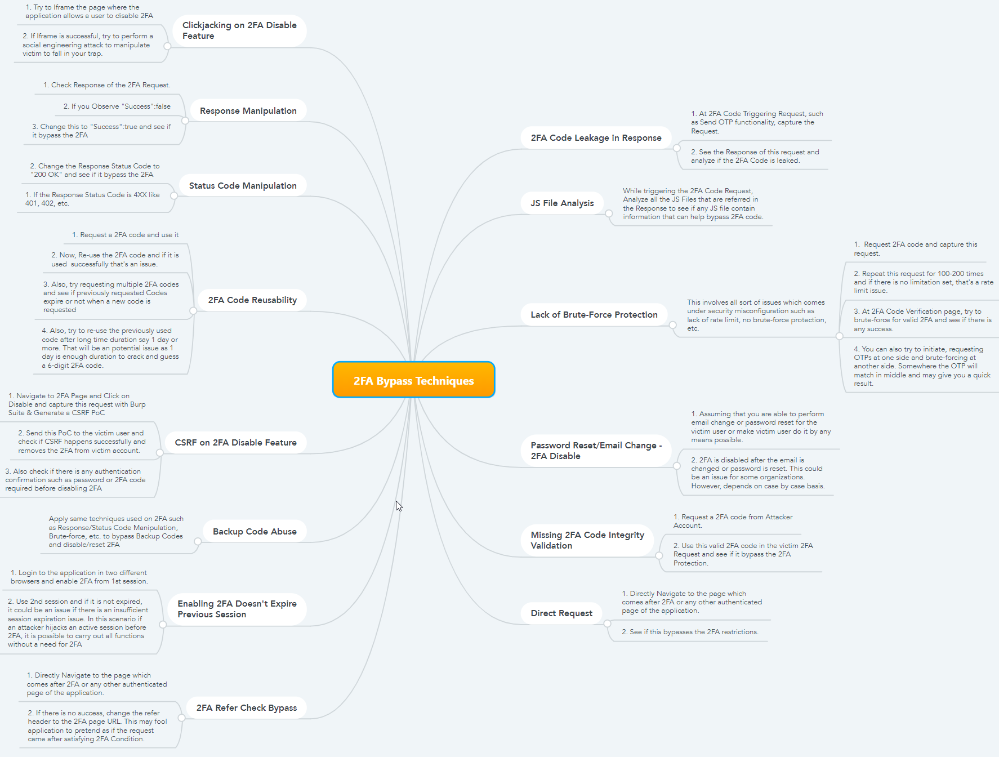

# MFA

## Common flaws

```
# Lack of rate limit
    - Exploitation:
    1. Request 2FA code and capture this request.
    2. Repeat this request for 100–200 times and if there is no limitation set, that’s a rate limit issue.
    3. At 2FA Code Verification page, try to brute-force for valid 2FA and see if there is any success.
    4. You can also try to initiate, requesting OTPs at one side and brute-forcing at another side. Somewhere the OTP will match in middle and may give you a quick result.
# Rate limit bypass
    # Limiting the flow rate
    # Generated OTP code doesn’t change
    # Rate-limit resetting when updating the code
    # Bypassing the rate limit by changing the IP address
    # Support for X-Forwarded-For turned on
# Bypass replacing part of the request from the session
# Bypass using the "Remember Me" functionality
    # If 2FA is attached using a cookie, the cookie value must be unguessable
    # If 2FA is attached to an IP address, you can try to replace your IP address
# Improper access control bug on the 2FA dialog page
# Insufficient censorship of personal data on the 2FA page
# Ignoring 2FA under certain circumstances.
    # 2FA ignoring when recovering a password
    # Ignoring 2FA when entering through a social network
    # Ignoring 2FA in an older version of the application
    # Ignoring 2FA in case of cross-platforming
# When disabling 2FA, the current code or password is not requested
# Previously created sessions remain valid after activation of 2FA
# Lack of Rate-limit in the user’s account (OTP is validated, but user's id not)
# Manipulation of API’s versions
# Improper Access Control in the backup codes request
# Response body manipulation
# HTTP Response Status Code Manipulation
# Code Leakage in Response
# Direct Request/Forceful Browsing
    - Exploitation:
    1. Normal flow: Login -> MFA -> Profile
    2. Attack: Login -> MFA, instead input MFA navigate to Profile
# Cached OTP in Dynamic JS Files
# OTP Code Reusability
```

## Mindmaps

.png>)

.png>)



```
https://medium.com/@iSecMax/two-factor-authentication-security-testing-and-possible-bypasses-f65650412b35
https://blog.cobalt.io/bypassing-the-protections-mfa-bypass-techniques-for-the-win-8ef6215de6ab
https://research.nccgroup.com/2021/06/10/testing-two-factor-authentication/
```
